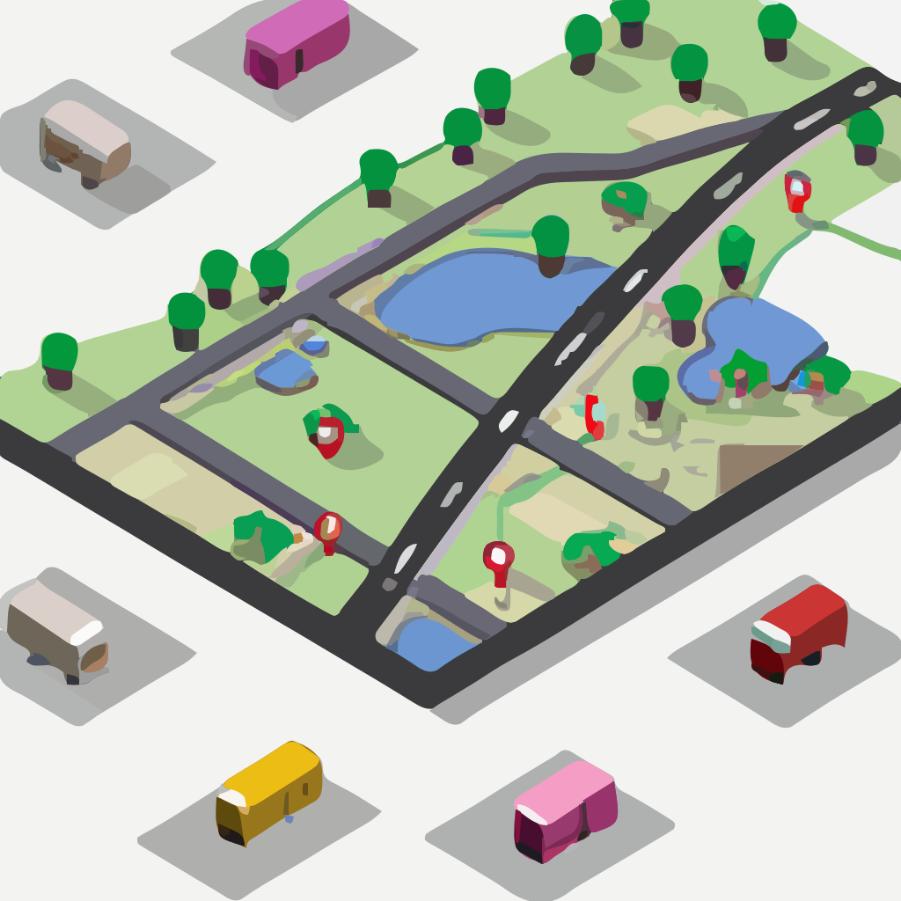

# Getting started with the Vehicle Routing Problem (VRP) 
> Explanatory medium post: https://medium.com/@kyberneees/a-pragmatic-educational-approach-to-the-vehicle-routing-problem-vrp-with-typescript-980ebe0c99d9

> Please note that this project presents an heuristic and experimental solution to the Vehicle Routing Problem using TypeScript for educational purposes only.  
Evaluate before use!

## Introduction


The Vehicle Routing Problem (VRP) is a classical optimization problem in the field of Operations Research. It involves finding the most efficient routes for a fleet of vehicles to deliver a set of customer orders. The objective is to minimize the total distance traveled by the vehicles while satisfying most orders.

In this VRP model, we have defined several classes to represent the problem:

* `Position`: represents a geographical location with latitude and longitude coordinates. 

* `DeliveryOrder`: represents a delivery order from a customer, including the customer ID, capacity, location, order ID and date/time. It also has a weight attribute that can be used to incorporate external factors such as traffic, weather, and road conditions.

* `Vehicle`: represents a delivery vehicle, including its capacity, current position, and vehicle ID.

* `DeliveryPlan`: represents the final delivery plan, including the vehicle routes and any pending delivery orders which could not be fulfiled.

The `DeliveryService` class is the main class that implements the VRP optimization. It takes in an array of vehicles and delivery orders as input and returns a DeliveryPlan as output.

## The algorithm
The algorithm in the `optimizeDeliveryPlan` method uses a heuristic approach, which means it uses a set of rules and techniques to find an acceptable solution in a reasonable time, instead of finding the exact and optimal solution. This approach is useful when solving problems with a large number of variables and an exhaustive search is computationally impractical.

The algorithm first sorts delivery orders ASC by "capacity * weight of the order" (where weight represents conditions such as Price, Traffic, Weather, Road, etc.). Then, vehicles are sorted based on the increasing distance between their current position and the order location, assigning delivery tasks first to vehicles closest to the order location.

The algorithm then assigns orders to vehicles by iterating through the orders and comparing the distance between each vehicle and the order location. The vehicle with the shortest total distance, considering both the current distance from the vehicle to the order and the distance from the last order to the current order, is chosen to deliver the order. The chosen vehicle's capacity is updated, and the delivery order is added to the vehicle's route.

This process continues until all orders have been assigned to vehicles or until no more vehicles are available to fulfill the orders. The final result is stored in a DeliveryPlan object, which contains the routes for each vehicle and the pending orders that couldn't be assigned to any vehicle.
```ts
class DeliveryService {
  constructor (
    private readonly vehicles: Vehicle[],
    private readonly orders: DeliveryOrder[]
  ) {
  }

  public optimizeDeliveryPlan (): DeliveryPlan {
    // Sort delivery orders ASC by capacity * weight
    // (weight = optional placeholder for conditions around Price, Traffic, Weather, Road, etc...)
    this.orders.sort((a, b) => a.capacity * a.weight - b.capacity * b.weight)

    // Sort vehicles ASC by distance between current position and order location
    this.vehicles.sort((a, b) => {
      const distanceA = a.currentPosition.distanceTo(this.orders[0].location)
      const distanceB = b.currentPosition.distanceTo(this.orders[0].location)

      return distanceA - distanceB
    })

    const routes = new VehicleRoutes()

    // Assign delivery orders to vehicles
    let orderIndex = 0
    for (; orderIndex < this.orders.length; orderIndex++) {
      const order = this.orders[orderIndex]

      let selectedVehicle: Vehicle | undefined
      let minDistance = Infinity

      for (const vehicle of this.vehicles) {
        if (vehicle.capacity >= order.capacity) {
          const currentDistance = vehicle.currentPosition.distanceTo(order.location)
          const lastOrder = routes.getVehicleLastOrder(vehicle)
          const distanceToOrder = (lastOrder != null)
            ? lastOrder.location.distanceTo(order.location)
            : currentDistance

          if (distanceToOrder < minDistance) {
            selectedVehicle = vehicle
            minDistance = distanceToOrder
          }
        }
      }

      if (selectedVehicle == null) {
        break
      }

      selectedVehicle.capacity = selectedVehicle.capacity - order.capacity
      selectedVehicle.currentPosition = order.location

      const route = routes.getVehicleRoute(selectedVehicle)
      route.push(order)
    }

    return new DeliveryPlan(routes.routes, this.orders.splice(orderIndex))
  }
}
```

## Running the demo

```bash
bun demos/basic.ts
```

Example output:
```bash
% time bun demos/basic.ts
Pending orders: 1
---------------------------
Vehicle ID: Vehicle1
Remaining vehicle capacity: 4
Vehicle position after route: (52.50583034392092, 13.33487304674146)
Route:
{
  "type": "FeatureCollection",
  "features": [
    {
      "type": "Feature",
      "properties": {},
      "geometry": {
        "type": "LineString",
        "coordinates": [
          [
            13.32991337766046,
            52.51034749703221
          ],
          [
            13.326686424912493,
            52.51034920018753
          ],
          [
            13.329485050516322,
            52.510093428426224
          ],
          [
            13.32628607773217,
            52.50973458196201
          ],
          [
            13.33403726888709,
            52.51205711618895
          ],
          [
            13.334879511915826,
            52.5103378908694
          ],
          [
            13.332391475570132,
            52.509951500211706
          ],
          [
            13.329234893876055,
            52.510733066267846
          ],
          [
            13.328660512426392,
            52.511833739904965
          ],
          [
            13.331454763227331,
            52.51173669284479
          ],
          [
            13.33487304674146,
            52.50583034392092
          ]
        ]
      }
    }
  ]
}
---------------------------
Vehicle ID: Vehicle2
Remaining vehicle capacity: 9
Vehicle position after route: (52.5063698629541, 13.329322007200192)
Route:
{
  "type": "FeatureCollection",
  "features": [
    {
      "type": "Feature",
      "properties": {},
      "geometry": {
        "type": "LineString",
        "coordinates": [
          [
            13.326426047309797,
            52.510440065872686
          ],
          [
            13.330706637328312,
            52.509267195367215
          ],
          [
            13.326181970858418,
            52.5099024454753
          ],
          [
            13.32689806191398,
            52.5092297820826
          ],
          [
            13.325051616688148,
            52.510381088184104
          ],
          [
            13.325999812207886,
            52.50966080779991
          ],
          [
            13.329461364176622,
            52.51069893085339
          ],
          [
            13.32546004859602,
            52.51139898626819
          ],
          [
            13.325642355963826,
            52.51196930630478
          ],
          [
            13.326725267395867,
            52.510105607170445
          ],
          [
            13.329322007200192,
            52.5063698629541
          ]
        ]
      }
    }
  ]
}
---------------------------
Vehicle ID: Vehicle3
Remaining vehicle capacity: 4
Vehicle position after route: (52.50591931839329, 13.329637703132038)
Route:
{
  "type": "FeatureCollection",
  "features": [
    {
      "type": "Feature",
      "properties": {},
      "geometry": {
        "type": "LineString",
        "coordinates": [
          [
            13.326882757181451,
            52.504763906426795
          ],
          [
            13.326899255875508,
            52.50498558326541
          ],
          [
            13.32519300845387,
            52.50332010156658
          ],
          [
            13.326075337659793,
            52.50455699877068
          ],
          [
            13.328288699765611,
            52.5029061043246
          ],
          [
            13.326111308110344,
            52.50447276487308
          ],
          [
            13.327809876539947,
            52.505148328946994
          ],
          [
            13.324920669211092,
            52.50609871688409
          ],
          [
            13.327204856312157,
            52.50739727470655
          ],
          [
            13.326045402201355,
            52.50564293812937
          ],
          [
            13.329637703132038,
            52.50591931839329
          ]
        ]
      }
    }
  ]
}
---------------------------
Vehicle ID: Vehicle4
Remaining vehicle capacity: 9
Vehicle position after route: (52.50262894639542, 13.331599573142837)
Route:
{
  "type": "FeatureCollection",
  "features": [
    {
      "type": "Feature",
      "properties": {},
      "geometry": {
        "type": "LineString",
        "coordinates": [
          [
            13.330308736865534,
            52.50504265774927
          ],
          [
            13.328098419280925,
            52.50528865358484
          ],
          [
            13.330970164975586,
            52.504618822039085
          ],
          [
            13.330413519327463,
            52.50575204033206
          ],
          [
            13.332082841544674,
            52.50369254870328
          ],
          [
            13.3274946829787,
            52.50558451357059
          ],
          [
            13.334078372367218,
            52.50387698723042
          ],
          [
            13.331599573142837,
            52.50262894639542
          ]
        ]
      }
    }
  ]
}
---------------------------
Vehicle ID: Vehicle5
Remaining vehicle capacity: 1
Vehicle position after route: (52.50691793951064, 13.333447768161468)
Route:
{
  "type": "FeatureCollection",
  "features": [
    {
      "type": "Feature",
      "properties": {},
      "geometry": {
        "type": "LineString",
        "coordinates": [
          [
            13.33407946635177,
            52.50481306081307
          ],
          [
            13.332805946758986,
            52.506696502901626
          ],
          [
            13.333419027267134,
            52.507721585753316
          ],
          [
            13.333500859976327,
            52.50760438278303
          ],
          [
            13.33148312808766,
            52.50756990797808
          ],
          [
            13.332174233192589,
            52.50935113715304
          ],
          [
            13.334488053576921,
            52.50544422740557
          ],
          [
            13.327831741022099,
            52.50430154187137
          ],
          [
            13.333447768161468,
            52.50691793951064
          ]
        ]
      }
    }
  ]
}
---------------------------
bun demos/basic.ts  0.01s user 0.01s system 94% cpu 0.024 total
```